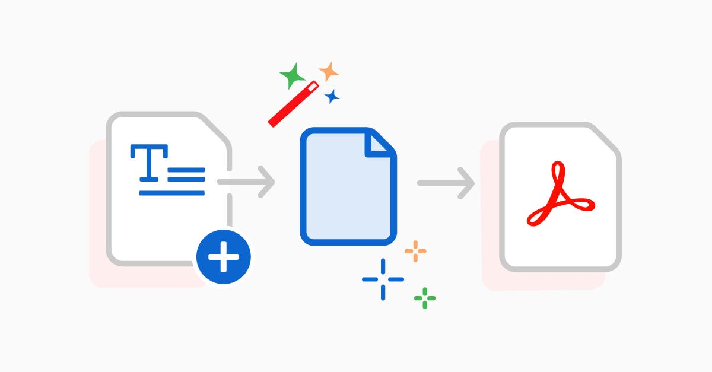

<br />

<div align="center">
  <div>
    
    
    
    
  </div>

  <h3 align="center">Word to PDF Converter( Full Stack MERN Application )</h3>
</div>

## 🔍 Overview
A modern **Full Stack Word to PDF Converter Web Application** built using **React.js, Node.js, Express.js, and Multer**. This application allows users to upload Microsoft Word files (.doc/.docx) and instantly convert them into PDF format with a clean, fast, and responsive user interface.
This project demonstrates **full-stack development, REST API integration, file handling, and modern frontend UI design**, making it ideal for portfolio and resume projects.

---

## 🚀 Features

- Upload Word files (.doc, .docx)
- Convert Word documents to PDF
- Download converted PDF files
- Fast and responsive React frontend
- REST API based backend
- Secure file upload using Multer
- Clean and modern UI with Tailwind CSS
- Full stack MERN architecture

---

## 🛠️ Tech Stack

### Frontend
- React.js
- Vite
- Tailwind CSS
- Axios
- JavaScript (ES6)

### Backend
- Node.js
- Express.js
- Multer (File upload middleware)
- File System (fs)

### Tools
- Git
- GitHub
- VS Code

---

## 📁 Project Structure

```bash
Word-to-PDF-Converter/
│
├── Backend/                         # Node.js & Express backend
│   ├── uploads/                    # Uploaded Word files
│   ├── files/                      # Converted PDF files
│   ├── index.js                    # Main server file
│   ├── package.json
│   └── package-lock.json
│
├── Frontend/                       # React (Vite) frontend
│   ├── public/                    # Static files
│   │
│   ├── src/
│   │   ├── components/            # UI components
│   │   │   ├── Navbar.jsx
│   │   │   ├── Home.jsx
│   │   │   └── Footer.jsx
│   │   │
│   │   ├── assets/                # Images and assets
│   │   ├── App.jsx                # Main App component
│   │   ├── main.jsx               # React entry point
│   │   └── index.css              # Global styles
│   │
│   ├── index.html                 # Root HTML
│   ├── package.json
│   └── package-lock.json
│
├── README.md                      # Documentation
└── .gitignore                     # Ignored files
```

## ⚙️ Installation and Setup

### Step 1: Clone Repository
```bash
git clone https://github.com/ktirumalaachari/Word-to-PDF-Converter.git
cd Word-to-PDF-Converter
```

---

### Step 2: Install Backend Dependencies
```bash
cd Backend
npm install
npm start
```

Backend runs on:  
```
http://localhost:5000
```

---

### Step 3: Install Frontend Dependencies
Open a new terminal and run:

```bash
cd Frontend
npm install
npm run dev
```

Frontend runs on:  
```
http://localhost:5173
```

---

## 🔌 API Endpoint

### Upload Word File
```bash
POST /upload
```

**Form Data**
```
file : Word file (.doc/.docx)
```

**Response**
```
Converted PDF file download link
```

---

## 💻 How It Works

1. User selects a Word file from the frontend  
2. File is sent to the backend using Axios  
3. Multer stores the file securely  
4. Backend converts the Word file to PDF  
5. PDF file is returned to the frontend  
6. User downloads the converted PDF  

---

## 🎯 Learning Outcomes

- Full Stack MERN development  
- File upload using Multer  
- REST API creation  
- React frontend integration  
- Backend-Frontend communication  
- Real-world project architecture  

---

## 📈 Future Improvements

- Drag and drop upload  
- Progress bar indicator  
- User authentication  
- Cloud storage support  
- Multiple file conversion  

---

## 📜 License
MIT License

Copyright (c) 2026 K Tirumala Acahri

Permission is hereby granted, free of charge, to any person obtaining a copy
of this software and associated documentation files (the "Software"), to deal
in the Software without restriction, including without limitation the rights
to use, copy, modify, merge, publish, distribute, sublicense, and/or sell
copies of the Software, and to permit persons to whom the Software is
furnished to do so, subject to the following conditions:

The above copyright notice and this permission notice shall be included in all
copies or substantial portions of the Software.

---

<div align="center">

## 👨‍💻 Author

**K Tirumala Achari**

[](https://github.com/ktirumalaachari)
[](https://ktirumalaachari.vercel.app/)
[](mailto:ktirumalaachari@gmail.com)
[](https://www.nist.edu/)

_Computer Science and Engineering Student_  
_NIST University, Berhampur, Odisha, India_

</div>

---

<div align="center">

⭐ **Star this repository if you find it helpful!** ⭐  

[🔝 Back to Top](#-word-to-pdf-converter--full-stack-mern-application)

</div>
